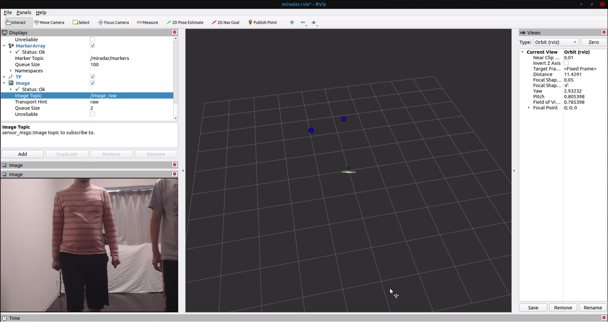
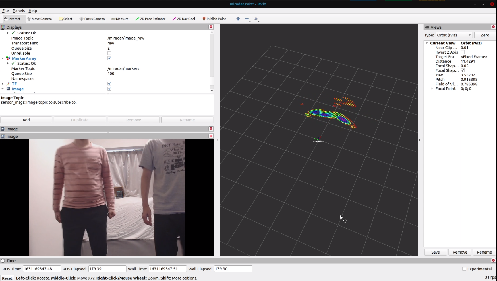
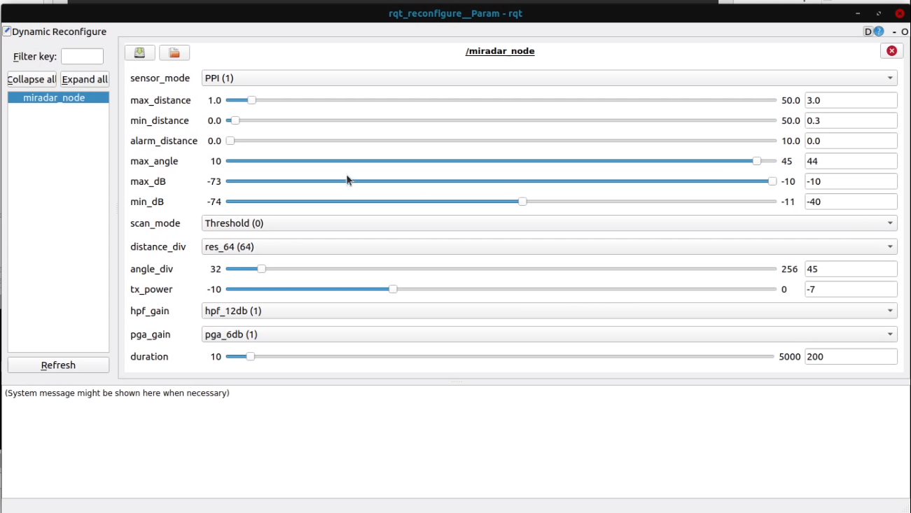

# miradar_node

ROS Node for miradar12e.
Parameters are available to set via dynamic_reconfigure.

## Acknowledgements
The original of this ROS Node was created by Quibitech Inc.  
The link is as follow.  
https://github.com/QibiTechInc/miradar_ros2_pkgs

## Launch
```
ros2 launch miradar_node miradar_rviz_launch.py
```

for X Window System (if your computer does not support Wayland)
```
QT_QPA_PLATFORM=xcb ros2 launch miradar_node miradar_rviz_launch.py
```

## PPI Mode


## Map Mode


## Tests
- [x] Lv1 : Library Unit Test : DONE, same library as miradar_node ROS1 impl
- [ ] Lv2 : ROS Node Unit Test : Skipping due to complexity of DI Implementation
- [x] Lv3 : ROS Node Test Integration Test : 60%, Manual Testing
- [x] Lv4 : Feature Test : DONE, Manual Testing

## Requirements
miradar_msgs (Build this first)
pcl_ros

## ROS Node
### miradar_node
ROS Node for converting miradar12e to ROS.

```bash
ros2 run miradar_node miradar_node  --ros-args devicename=/dev/ttyUSB0
```

### ppi_visualizer.py
PPI data rviz visualization node.
```bash
ros2 run miradar_node ppi_visualizer.py
```

## Topic
## /miradar/ppidata : miradar_node/PPIData
ROS Topic to retreive ppidata.
This topic will be sent only the sensormode is in PPI Mode.

## /miradar/image_raw : sensor_msgs/Image
ROS Topic to retreive mapdata.
This topic will be sent only the sensormode is in Map mode.  　　

## /miradar/markers : visualization_msgs/MarkerArray
ROS Topic to visualize PPI data in RVIZ.
The red marker means strong signal(db), and the blue marker means weak signal.

## /miradar/scan : sensor_msgs/LaserScan
ROS Topic of the radar scan in LaserScan format.

## /miradar/points : sensor_msgs/PointCloud2
ROS Topic of the radar scan in pointclouds.


## ROS Parameter
### devicename : str
setup the device name as devicefile.
e
Linux
```bash
ros2 run miradar_node miradar_node _devicename:=/dev/ttyUSB0
```

## Dynamic Reconfigure Param


### sensor_mode : Halt, PPI, Map
Choose the sensor mode to halt(0), ppi(1), and map(2).

### max_distance : int
Choose the max distance of the sensor range.

### min_distance : int
Choose the min distance of the sensor range.

### alarm_distance : int
Choose the alarm distance of the sensor range.

### max_angle : int
Choose the max angle of the sensor range.

### min_angle : int
Choose the min angle of the sensor range.

### distance_div : int
Choose the resolution of the map in distance direction.  Valid parameters are {32, 64, 128, 256}.

### angle_div : int
Choose the resolution of the map in angle direction.


### max_dB : int
Choose the max db of the sensor sensitivity.

### min_dB : int
Choose the min db of the sensor sensitivity.

### tx_power : int
Choose the power of the TX signal via RS485 communication. Default value recommended.

### hpf_gain : 0db, 12db, 18db
Choose the hpf gain.

### pga_gain : 0db, 6db, 12db, 18db, 24db
Choose the pga gain.

### duration : int
Choose the sensor response time in ms.
